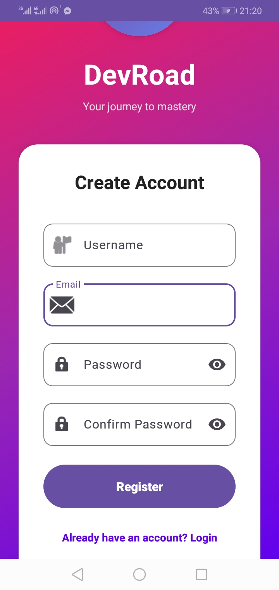
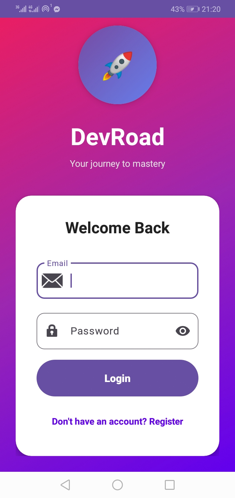
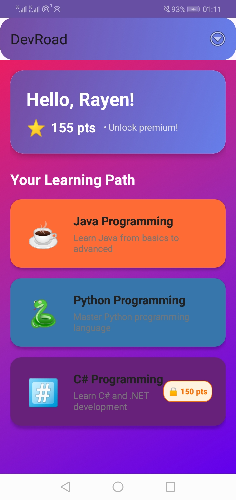
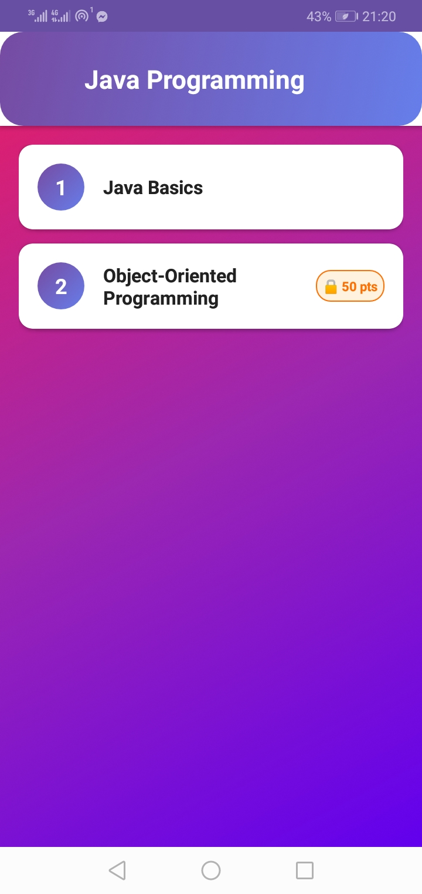
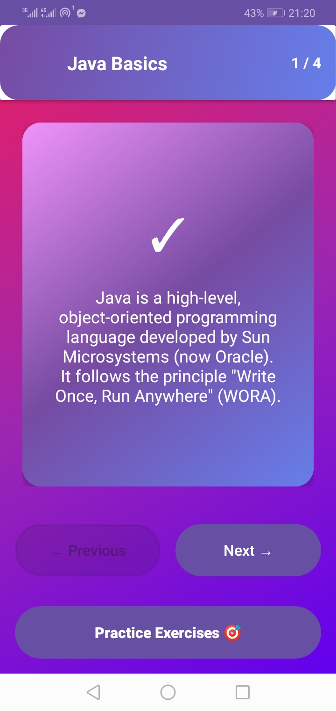
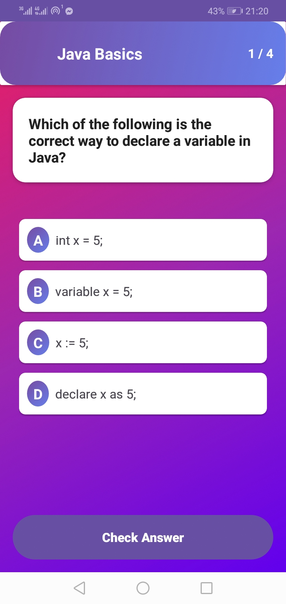

# DevRoad - Interactive Coding Learning App 🚀

DevRoad is an Android application that provides an interactive learning experience for programming languages through lessons, flashcards, and various types of exercises.

## Screenshots 📱

  
  
  

  
  
  
  

## Features ✨

- **User Authentication**: Sign up and login using Supabase authentication
- **Score-Based Progress**: Earn points by completing exercises to unlock premium content
- **Multiple Courses**: Java, Python, and C# courses with more to come
- **Interactive Flashcards**: Learn concepts with flip-card animations
- **4 Types of Exercises**:
  - 🎯 Multiple Choice - Modern styled choice selection
  - 🧩 Drag and Drop - Interactive drag-and-drop matching
  - ✍️ Fill in the Blanks - Choose correct options for code completion
  - 📝 Arrange Code - Drag to reorder code lines correctly
- **Immersive Sound System** 🔊:
  - 🎵 Background music that plays automatically when you enter the app
  - ✅ Correct answer sound effect with visual feedback
  - ❌ Wrong answer sound effect with shake animation
  - 🎚️ Toggle music and sound effects on/off from the home page
  - 🔇 Persistent sound preferences (saved between sessions)
- **Beautiful UI**: Gradient backgrounds, smooth animations, and modern design
- **Progress Tracking**: Track your learning progress for each lesson

## Prerequisites 📋

- Android Studio (latest version)
- Java JDK 11 or higher
- Supabase account (already configured with your credentials)
- Android device or emulator (API 24+)

## Dependencies 📦

- Retrofit 2.9.0 - REST API client
- Gson 2.10.1 - JSON parsing
- OkHttp 4.11.0 - HTTP client with logging
- Material Components - UI components
- CardView & RecyclerView - List displays

## License 📄

This project is created for educational purposes.

## Support 💬

For issues or questions:
1. Check the troubleshooting section
2. Review Supabase documentation
3. Check Android Logcat for errors
4. Verify database data in Supabase dashboard

---

**Happy Coding! 🚀** Start your learning journey with DevRoad!
